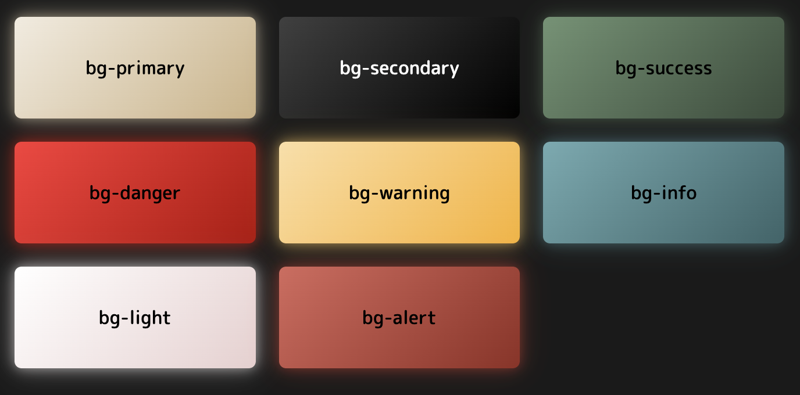

# Clase de colores neon 

Aplicacion de gradientes neon a los colores primarios version neon:

Para usarlo debes Aplicar las siguientes clases para obtener el fondo de color deseado.

Clases base:
```css 
.bg-primary-neon
.bg-secondary-neon
.bg-success-neon
.bg-danger-neon
.bg-warning-neon
.bg-info-neon
.bg-light-neon
.bg-alert-neon
```



## Clases para aplicar hover a `bg-{color}-neon`

Para aplicar un estilo hover debes agregar la clase `.hover-neon`, si se necesita eplicar estilo neon sin necesida de hover usar la clase `.hover-neon-active` resultado que se obtiene:

```css 
.hover-neon /* Aplcica un estilo de hover al pasar el cursor */
.hover-neon-active /* Activa el estilo hover sin necesidad de pasar el cursor*/
```


# Estructura grid layout

## Sistema de Cuadrícula

Nuestro sistema de layout está basado en contenedores flexibles que agrupan columnas.

## Clase `row`

La clase `row` es el contenedor principal para agrupar columnas. Utiliza `display: flex` y `flex-wrap: wrap` para organizar las columnas en una fila.

### Ejemplo Básico

```html
<div class="row">
    <div class="col">Columna 1</div>
    <div class="col">Columna 2</div>
    <div class="col">Columna 3</div>
</div>
```

## Clase `row-cols-*`

La clase `row-cols-*` define el número de columnas predeterminadas, sirve cuando no se desea definir en las columnas el ancho, aplicando esta clase se puede definir desde el contenedor el comportamiento del contenido.

### posibles valores `$grid-row-columns:  6;`

- `row-cols-1`: Una columna por fila.
- `row-cols-2`: Dos columnas por fila.
- `row-cols-3`: Tres columnas por fila.
- `row-cols-4`: Cuatro columnas por fila.
- `row-cols-6`: Seis columnas por fila.

### Breakpoints Responsivos

Puedes usar variantes responsivas para ajustar el número de columnas según el tamaño de la pantalla:

- `row-cols-sm-*`: Para pantallas pequeñas (≥ 576px).
- `row-cols-md-*`: Para pantallas medianas (≥ 768px).
- `row-cols-lg-*`: Para pantallas grandes (≥ 992px).
- `row-cols-xl-*`: Para pantallas extra grandes (≥ 1200px).
- `row-cols-xxl-*`: Para pantallas muy grandes (≥ 1400px).

### Ejemplo Responsivo

```html
<div class="row row-cols-1 row-cols-md-2 row-cols-lg-4">
    <div class="col">Columna 1</div>
    <div class="col">Columna 2</div>
    <div class="col">Columna 3</div>
    <div class="col">Columna 4</div>
    <div class="col">Columna 5</div>
    <div class="col">Columna 6</div>
</div>
```

## Clases de Alineación para Filas `row`

### Alineación Vertical (`align-items-*`)

- `.align-items-start`: Alinea los elementos al inicio.
- `.align-items-center`: Centra los elementos verticalmente.
- `.align-items-end`: Alinea los elementos al final.

### Alineación Horizontal (`justify-content-*`)

- `.justify-content-start`: Alinea los elementos al inicio.
- `.justify-content-center`: Centra los elementos horizontalmente.
- `.justify-content-end`: Alinea los elementos al final.
- `.justify-content-around`: Espacio uniforme alrededor de los elementos.
- `.justify-content-between`: Espacio uniforme entre los elementos.
- `.justify-content-evenly`: Espacio igual entre y alrededor de los elementos.


# Clases de Espaciado para las columnas

## Clase `g` de gap 
La clase `g` controla el espaciado general entre las columnas y filas dentro de un `row`. 

## Clase `gx`
La clase `gx` controla el espaciado horizontal entre las columnas dentro de un `row`. 

## Clase `gy`
La clase `gy` controla el espaciado vertical entre las filas dentro de un `row`. 

## 4. Valores Disponibles
Los valores de `gap`, `gx`, y `gy` :

**Clases generadas:**
- `.g-0`, `.gx-0`, `.gy-0`: Sin espaciado.
- `.g-1`, `.gx-1`, `.gy-1`: Espaciado de `0.25rem`.
- `.g-2`, `.gx-2`, `.gy-2`: Espaciado de `0.5rem`.
- `.g-3`, `.gx-3`, `.gy-3`: Espaciado de `0.75rem`.
- `.g-4`, `.gx-4`, `.gy-4`: Espaciado de `1rem`.
- `.g-5`, `.gx-5`, `.gy-5`: Espaciado de `1.25rem`.

### Ejemplo Básico

```html
<div class="row g-3">
    <div class="col">Columna 1</div>
    <div class="col">Columna 2</div>
    <div class="col">Columna 3</div>
</div>
```
---
# Clase col

La clase `col` Se utiliza para definir el ancho de las columnas dentro de una fila (`row`). Las columnas son flexibles y se ajustan automáticamente al espacio disponible, pero también puedes personalizarlas con variantes específicas.

## 1. Clase Básica: `.col`

**Descripción:**  
La clase `.col` hace que una columna ocupe un ancho igual al de las demás columnas en la misma fila.

**Ejemplo:**  
```html
<div class="row">
    <div class="col">Columna 1</div>
    <div class="col">Columna 2</div>
    <div class="col">Columna 3</div>
</div>
```

## 2. Columnas de Tamaño Fijo: `.col-{n}`

### Tamaño Fijo
Define el ancho de la columna en proporción al total (12 columnas):

- `.col-1`, `.col-2`, ..., `.col-12`

**Ejemplo:**  
```html
<div class="row">
    <div class="col-4">Columna 1</div>
    <div class="col-8">Columna 2</div>
</div>
```

### Responsivo
Define el ancho de la columna en diferentes puntos de quiebre (breakpoints):

- `.col-sm-*`, `.col-md-*`, `.col-lg-*`, `.col-xl-*`, `.col-xxl-*`

**Ejemplo:**  
```html
<div class="row">
    <div class="col-12 col-md-6 col-lg-4">Columna 1</div>
    <div class="col-12 col-md-6 col-lg-8">Columna 2</div>
</div>
```

### Autoajuste

- `.col-auto`: Ajusta el ancho de la columna al contenido.

**Ejemplo:**  
```html
<div class="row">
    <div class="col-auto">Columna ajustada al contenido</div>
    <div class="col">Columna restante</div>
</div>
```

## Columnas de Ancho Dinámico: `.col-{breakpoint}-auto`

Puedes especificar el comportamiento en diferentes breakpoints.

- `.col-sm-auto`, `.col-md-auto`, `.col-lg-auto`, `.col-xl-auto`, `.col-xxl-auto`

**Ejemplo:**  
```html
<div class="row">
    <div class="col-auto col-md-auto">Columna ajustada al contenido</div>
    <div class="col">Columna restante</div>
</div>
```

## Clases de Alineación para Columnas

### Alineación Individual (`align-self-*`)

- `.align-self-start`: Alinea la columna al inicio.
- `.align-self-center`: Centra la columna verticalmente.
- `.align-self-end`: Alinea la columna al final.
- `.align-self-baseline`: Alinea la columna con la línea base.
- `.align-self-stretch`: Estira la columna para llenar el espacio disponible.

# Clase Offset

La clase `offset` se utiliza para agregar un margen izquierdo a las columnas en el sistema de grid, desplazándolas hacia la derecha.

### Ejemplo de clases

- `.offset-0`: Sin desplazamiento.
- `.offset-1`: Desplaza la columna 1/12 del ancho total.
- `.offset-2`: Desplaza la columna 2/12 del ancho total.
- ...
- `.offset-12`: Desplaza la columna 12/12 del ancho total (100%), crea un salto de linea en la fila.

### offset responsive `.offset-{breakpoint}-{n}`

- **{breakpoint}**: Define el punto de quiebre (breakpoint) en el que se aplica el desplazamiento.
- **{n}**: Define el número de columnas que se desplaza la columna hacia la derecha.

### Ejemplo con breakpoints:

- `.offset-sm-1`: Desplazamiento de una columna (≥ 576px).
- `.offset-md-3`: Desplazamiento de tres columnas (≥ 768px).
- `.offset-lg-6`: Desplazamiento de seis columnas (≥ 992px).

### Ejemplo
```html
    <div class="container">
        <div class="row">
         
            <div class="col-4 offset-2 bg-primary text-white text-center">
                Columna 1
            </div>
        
            <div class="col-6 bg-secondary text-white text-center">
                Columna 2
            </div>
        </div>
        <div class="row mt-4">
            <div class="col-6 offset-md-3 bg-success text-white text-center">
                Columna centrada
            </div>
        </div>
    </div>
```


# Clase `.grid`

La clase `.grid` es el contenedor principal que define un diseño basado en un sistema de columnas. Utiliza `display: grid` para organizar los elementos. 

- Utiliza un sistema de 12 columnas por defecto.
- Permite definir el número de columnas por fila y el espaciado entre ellas.

## Clase `.g-col-{n}`

La clase `.g-col-{n}` define las columnas dentro de un contenedor `.grid`. 

#### Tamaño fijo:
- `.g-col-{n}`: Define el ancho de la columna en proporción al total de 12 columnas. Por ejemplo:

- `.g-col-6`: Ocupa 6/12 del ancho total (50%).
- `.g-col-4`: Ocupa 4/12 del ancho total (33.33%).


### Ejemplo:

```html
<div class="grid">
  <div class="g-col-4">Columna 1</div>
  <div class="g-col-4">Columna 2</div>
  <div class="g-col-4">Columna 3</div>
</div>
```

#### tamaño de columnas responsive `.g-col-{breakpoint}-{n}`:
- `.g-col-{breakpoint}-{n}`: Define el ancho de la columna en diferentes breakpoints. Por ejemplo:
    - `.g-col-md-6`: Ocupa 6/12 del ancho total en pantallas medianas (≥ 768px).
    - `.g-col-lg-4`: Ocupa 4/12 del ancho total en pantallas grandes (≥ 992px).

```html

<div class="grid">
  <div class="g-col-6 g-col-md-4">Columna 1</div>
  <div class="g-col-6 g-col-md-4">Columna 2</div>
  <div class="g-col-6 g-col-md-4">Columna 3</div>
</div>

```

## Clase base `g-row-{n}`
La clase `g-row-<n>` se utiliza para especificar cuántas filas debe abarcar un elemento dentro de un contenedor de cuadrícula.  

## Clases responsivas
Las variantes responsivas como `g-row-sm-<n>`, `g-row-md-<n>`, `g-row-lg-<n>`, etc., permiten definir el comportamiento del elemento en diferentes puntos de quiebre (*breakpoints*).  

### Ejemplo basico

```html 
<div class="grid">
  <div class="g-row-2">Este elemento ocupa 2 filas</div>
  <div class="g-row-1">Este elemento ocupa 1 fila</div>
</div>

```

### Ejemplo con filas responsivas  `g-row-sm-`, `g-row-md-`

```html
<div class="grid">
    <div class="g-row-sm-2 g-row-md-3 g-row-lg-4 bg-primary text-white text-center">
        Este elemento ocupa:
        <ul>
            <li>2 filas en pantallas pequeñas</li>
            <li>3 filas en pantallas medianas</li>
            <li>4 filas en pantallas grandes</li>
        </ul>
    </div>
    <div class="g-row-1 bg-secondary text-white text-center">
        Este elemento ocupa 1 fila
    </div>
    <div class="g-row-2 bg-success text-white text-center">
        Este elemento ocupa 2 filas
    </div>
</div>
```

### Ejemplo de combinacion usando filas y columnas 

```html 
<div class="grid">
  <div class="g-col-2 g-row-3">Este elemento ocupa 2 columnas y 3 filas</div>
  <div class="g-col-1 g-row-1">Este elemento ocupa 1 columna y 1 fila</div>
</div>
```

# Clases de Espaciado para las columnas contenedor `.grid`

## Clase `gap` 
La clase `gap` controla el espaciado general entre las columnas y filas dentro de un `.grid` predeterminado tiene `1rem`. 

**Clases generadas:**
- `.gap-0`:  Sin espaciado.
- `.gap-1`: Espaciado de `0.25rem`.
- `.gap-2`: Espaciado de `0.5rem`.
- `.gap-3`: Espaciado de `0.75rem`.
- `.gap-4`: Espaciado de `1rem`.
- `.gap-5`: Espaciado de `1.25rem`.

```html
<div class="grid gap-4">
  <div class="g-col-2">Elemento 1</div>
  <div class="g-col-1">Elemento 2</div>
</div>
```