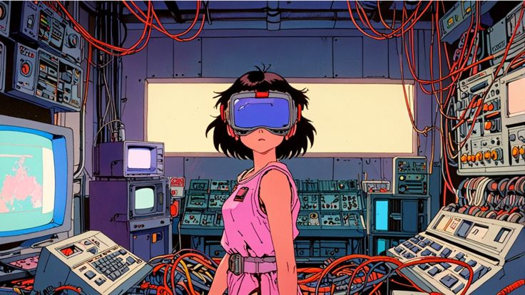

# RETROSCI-FI LIBRARY

<div align="center">
  
</div>

 **RetroSci-fi** es una librería de componentes inspirada en la ciencia ficción retro de Japón. Basada en Bootstrap, está desarrollada completamente desde cero con SASS, usando clases reutilizables, estructura modular y un sistema de diseño personalizable.

 <!--  -->
## 🚀 Implementación de los estilos en tu página web

### 🌐 Opción 1: Utiliza la **CDN**
  1.  **Coloca el link y script en el head de tu html**

      ```html
      <link rel="stylesheet" href="node_modules/retrosci-fi_library/dist/css/sci-fi.css" crossorigin="anonymous">
      <script src="link" crossorigin="anonymous" defer></script>
      ```
  2.  **Listo utiliza las clases en tu html**

      Ahora puedes usar las clases de la librería en tu HTML. Por ejemplo:
      ```html
      <button class="btn btn-primary">Haz clic aquí</button>
      ```

### 💡 Opción 2: Descarga con **npm**

1. **Instalar la librería**  
   Ejecuta el siguiente comando en tu terminal para instalar la librería:
   ```bash
   npm i retrosci-fi_library
   ```

2. **Incluir el archivo en tu HTML**  
   Agrega el archivo CSS en el `<head>` de tu archivo HTML:
   ```html
   <link rel="stylesheet" href="node_modules/retrosci-fi_library/dist/css/sci-fi.css">
   ```

3. **Usar las clases en tu HTML**  
   Ahora puedes usar las clases de la librería en tu HTML. Por ejemplo:
   ```html
   <button class="btn btn-primary">Haz clic aquí</button>
   ```

---

### ⛺ Opción 3: Clonar el repositorio con **git clone** o descarga del ZIP

1. **Clonar el repositorio**  
   Ejecuta el siguiente comando en tu terminal para clonar el repositorio:
   ```bash
   git clone https://github.com/Mixgyt/RetroSci-Fi_library.git
   ```

2. **Compilar los estilos (opcional)**  
   Si deseas personalizar los estilos, puedes compilar los archivos SCSS. Usa el siguiente comando para compilar:
   ```bash
   npm run css-compile
   ```

3. **Incluir el archivo CSS en tu proyecto**  
   Copia el archivo CSS generado en la carpeta `dist/css/sci-fi.css` a tu proyecto o enlázalo directamente desde la carpeta clonada:
   ```html
   <link rel="stylesheet" href="retrosci-fi_library/dist/css/sci-fi.css">
   ```

4. **Usar las clases en tu HTML**  
   Al igual que con la instalación por npm, puedes usar las clases de la librería en tu HTML:
   ```html
   <button class="btn btn-primary">Haz clic aquí</button>
   ```
 **Consulta la documentación completa**  
> Para más detalles sobre cómo usar la librería y ejemplos prácticos, visita nuestra [documentación oficial](#).

## 🎨 Paleta de colores

<div align="center">
  <table>
    <thead>
      <tr>
        <th style="text-align:center;">Nombre variable</th>
        <th style="text-align:center;">Color</th>
        <th style="text-align:center;">Hexadecimal</th>
      </tr>
    </thead>
    <tbody>
      <tr>
        <td style="text-align:center;">Primary</td>
        <td style="text-align:center;"></td>
        <td style="text-align:center;">#DCC9A9</td>
      </tr>
      <tr>
        <td style="text-align:center;">Secondary</td>
        <td style="text-align:center;"></td>
        <td style="text-align:center;">#1A1A1A</td>
      </tr>
      <tr>
        <td style="text-align:center;">Success</td>
        <td style="text-align:center;"></td>
        <td style="text-align:center;">#4E6851</td>
      </tr>
      <tr>
        <td style="text-align:center;">Info</td>
        <td style="text-align:center;"></td>
        <td style="text-align:center;">#4B848A</td>
      </tr>
      <tr>
        <td style="text-align:center;">Warning</td>
        <td style="text-align:center;"></td>
        <td style="text-align:center;">#FBC359</td>
      </tr>
      <tr>
        <td style="text-align:center;">Danger</td>
        <td style="text-align:center;"></td>
        <td style="text-align:center;">#E70103</td>
      </tr>
      <tr>
        <td style="text-align:center;">Light</td>
        <td style="text-align:center;"></td>
        <td style="text-align:center;">#F9F2F2</td>
      </tr>
      <tr>
        <td style="text-align:center;">Alert</td>
        <td style="text-align:center;"></td>
        <td style="text-align:center;">#BB3A2D</td>
      </tr>
    </tbody>
  </table>
</div>


## 🛠️ Ejemplos de implementación
### Botones
<div align="center">
  
</div>

### Navbar
<div align="center">
  
</div>

### Formularios
<div align="center">
  
</div>

<div align="center">
  
</div>

### Card
<div align="center">
  
</div>

### Clase de colores neon 
creacion de gradientes neon a los colores primarios:

Para usarlo debes Aplicar las siguientes clases para obtener el fondo de color deseado.

Clases base:

```css 
.bg-primary-neon
.bg-secondary-neon
.bg-success-neon
.bg-danger-neon
.bg-warning-neon
.bg-info-neon
.bg-light-neon
.bg-alert-neon
```


### Clases para aplicar hover a `bg-{color}-neon`

Para aplicar un estilo hover debes agregar la clase `.hover-neon`, si se necesita eplicar estilo neon sin necesida de hover usar la clase `.hover-neon-active` resultado que se obtiene:

```css 
.hover-neon /* Aplcica un estilo de hover al pasar el cursor */
.hover-neon-active /* Activa el estilo hover sin necesidad de pasar el cursor*/
```


---
## 👨🏻‍💻 Integrantes

✅ - Cesar Enoc Aparicio Reyes (**AA23026**) <br>
✅ - Cesar Alexander Garay Ortez (**GO22007**) <br>
✅ - Gerson Mauricio Alegria Caballero (**AC23014**) <br>
✅ - Juan Antonio Sandoval Paiz (**SP23002**) <br>

## Tecnologias y herramientas usadas

<div align="center">
    <br>
</div>
